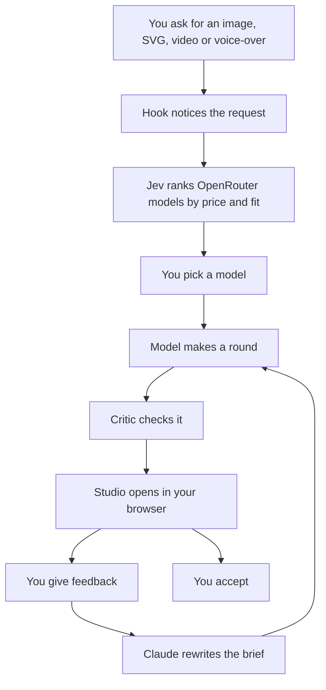
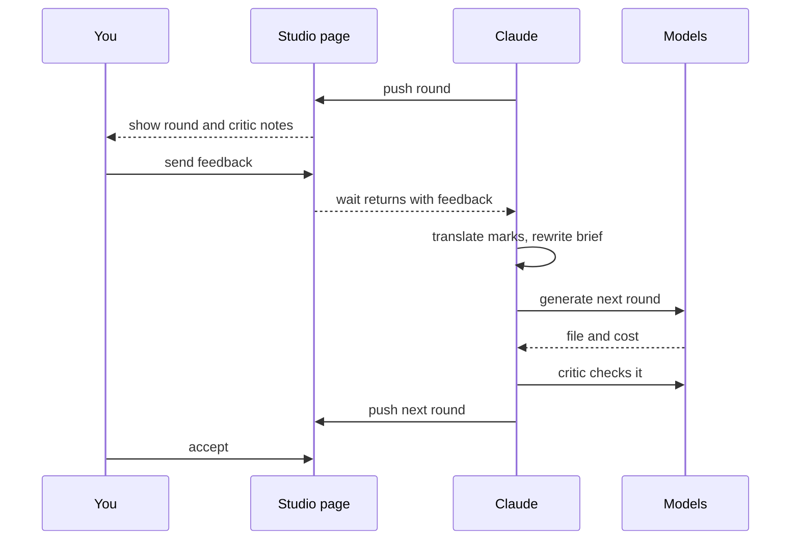

<p align="center"><picture><source media="(prefers-color-scheme: dark)" srcset="assets/logo-dark.png"></picture></p>

# clouter

clouter is a Claude Code plugin for making images, SVGs, video and
speech. Ask Claude for a logo, an illustration, a short clip or a
voice-over and instead of Claude describing the thing in words, a real
OpenRouter model makes it, at a price you see up front, and you steer the
result in a browser studio until it's right.

## How it works

1. A hook notices the request. `skills/visual/route.py` watches every
   prompt you send and reacts to visual ones (a logo, an SVG, a video, a
   voice-over, ...).
2. [Jev](https://typesafe.ai), TypeSafe's decision model, works out what
   kind of file you want (raster image, vector SVG, video or speech) and
   ranks OpenRouter's models for it by price and fit.
3. You pick a model from that ranked list, or choose to stay with Claude.
4. The chosen model makes round 1.
5. For an image or SVG, a vision-model critic looks it over and lists what
   it thinks is wrong.
6. The studio opens in your browser with the result and the critic's
   notes.
7. You give feedback: type new instructions, tick a critic suggestion,
   draw on the image, drop notes on the video or audio timeline, or pick
   a different model.
8. Claude turns your feedback into a better brief and makes the next
   round, and the loop goes back to step 5.
9. You press Accept on the round you like, and Claude reports the file
   and the total cost.



Before the paid request, `skills/visual/spec.py` fetches the picked
model's own `llms.txt`, so the request only uses fields that model
actually supports (resolution, seed, generate_audio, ...) instead of a
generic guess. When a model's `llms.txt` turns out wrong and a request
still fails (a speech model that rejects mp3 but takes pcm, an image
model that only answers on `/api/v1/images`), `generate.py`'s fallback
catches it and remembers the fix in `learned.json` for 30 days, so the
next request to that model goes right the first time.

## The studio

Every generated image, SVG, video or speech clip opens in a browser page
on `127.0.0.1`. In the page you can:

- see each round and the critic's summary of it
- edit an image with a pen tool (colour and line width), an eraser, and
  numbered note pins
- mark up video or audio with timeline markers and notes
- type new instructions in a feedback box
- accept or dismiss a critic suggestion
- pick a different model, or branch off a round to explore a variant
- press Accept once a round is right



The critic's translate mode turns your drawn annotations and timeline
markers into region-anchored instructions for the next prompt, so a note
pinned on the logo's left eye becomes a specific fix rather than a vague
"fix the eye". Session state is saved in
`~/.cache/clouter/studio/<id>/` (`session.json`, `rounds/`, `uploads/`),
so closing the tab and coming back later picks up where you left off.

## Install

Install from the marketplace:

```bash
claude plugin marketplace add dimitritholen/clouter
claude plugin install clouter@clouter
```

For development, install from your local clone:

```bash
claude plugin marketplace add ~/dev/clouter
claude plugin install clouter@clouter
```

Or run a one-off development session without installing:

```bash
claude --plugin-dir ~/dev/clouter
```

## Key setup

Run once, in a session:

```
/clouter:visual setup
```

This runs `skills/visual/setup-key.py`, which opens an OAuth flow in the
browser, takes the callback on `127.0.0.1`, checks the key and stores it in
`~/.config/clouter/credentials` (mode 0600). If the browser cannot reach the
machine, the same run serves a paste page whose URL is printed on stderr;
`--tty` reads a hidden prompt instead. Nothing prints the key. An
`OPENROUTER_API_KEY` in the environment wins over the stored file.

## Configuration

| Variable | Default | What it does |
|---|---|---|
| `CLOUTER_VISUAL` | `1` | Set to `0`, `off` or `false` to keep the hook silent entirely. |
| `CLOUTER_VISUAL_FLOOR` | `0.5` | Summed visual probability under which the hook stays silent, and the model-confidence floor under which it drops the recommendation. |
| `CLOUTER_VISUAL_MULTI` | `0.3` | Probability from which a further visual modality in the same prompt counts as requested too. |
| `CLOUTER_VISUAL_LOG` | `visual.jsonl` next to the credentials file | Cost log path override. |
| `CLOUTER_POLL_SECONDS` | `5` | Poll interval, in seconds, while waiting on a video generation job. |
| `CLOUTER_COST_WAIT_SECONDS` | unset (steps up to 8s, ~23s total) | Caps each step of the backoff while polling a speech generation's cost lookup (5 retries on 404). Mainly for tests. |
| `CLOUTER_CRITIQUE` | `1` | Set to `0`, `off` or `false` to skip the post-generation critique pass (same as `--no-critique`). Video and speech are never critiqued. |
| `CLOUTER_CRITIC` | built-in default model | Overrides the vision model used for critique; `--critic` on the command line wins over it. |
| `CLOUTER_CREDENTIALS` | `~/.config/clouter/credentials` | Overrides the credentials file path, mainly for tests. |
| `CLOUTER_LEARNED` | `learned.json` next to the credentials file | Full path of the store of what providers rejected and what worked per model (entries expire after 30 days). Mainly for tests. |

## Running tests

```bash
bash tests/run-all.sh
```

## License

MIT license. See LICENSE for details.

## If you also run 1337-claude

1337-claude carries its own visual router with the same hook shape. With
both plugins installed, set `CLAUDE_1337_VISUAL=0` so only clouter's hook
fires on a prompt.
